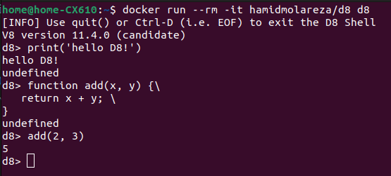

<div align="center">
  <h1>V8 Docker Image</h1>
  <br />
  <a href="#getting-started"><strong>Getting Started »</strong></a>
  <br />
  <br />
  <a href="https://github.com/HamidMolareza/v8-docker/issues/new?assignees=&labels=bug&template=BUG_REPORT.md&title=bug%3A+">Report a Bug</a>
  ·
  <a href="https://github.com/HamidMolareza/v8-docker/issues/new?assignees=&labels=enhancement&template=FEATURE_REQUEST.md&title=feat%3A+">Request a Feature</a>
  .
  <a href="https://github.com/HamidMolareza/v8-docker/issues/new?assignees=&labels=question&template=SUPPORT_QUESTION.md&title=support%3A+">Ask a Question</a>
</div>

<div align="center">
<br />


[](https://github.com/HamidMolareza/v8-docker/issues?q=is%3Aissue+is%3Aopen+label%3A%22help+wanted%22)
[](https://github.com/HamidMolareza)

</div>

## About

### Introduction

This project provides an **easy** and straightforward way to use **Google's V8 engine** in a Docker container, eliminating the need to install and configure `V8` on your local machine.

This project is a **docker image** with a flexible and customizable entrypoint script that provides an isolated environment to run javascript programs with Google `V8` engine. 
It allows you to easily test and develop code without worrying about dependencies and setup `V8`.

### What problem does it solve?

The purpose of this project is to provide a pre-configured Docker image for developers who require the `V8` engine. 

This project solves the problem of setting up and configuring `V8` on your local machine, which can be time-consuming and challenging, especially for beginners. With this docker image, you can run `V8` engine in a container with a single command, making it easy to start experimenting with `V8`.

### Motivation

[Quera](https://quera.org/) website uses `V8` engine to evaluate JavaScript solutions. Installing this engine is a difficult task, so I decided to develop this project to solve this problem, practice Docker and Python and have some **fun**!

This project is forked from the [andreburgaud](https://github.com/andreburgaud/docker-v8) project which is a very good project. The problem of that project was that its entrypoint was not flexible and convenient. 
My project supports various commands. Especially the new `run` command that allows you to run javascript programs with several input files with one line and see the result. I also changed the address of the entrypoint file so that it is easier to replace or complete it with a desired entrypoint.

It is also tried to use the best structures in this project. For example, using test cases, `tox`, git hooks, GitHub actions, etc. This makes it easier to maintain the project in the future.

### Conclusion

This project aims to make it easier for developers to use the `V8` engine by providing a Docker image that can be easily installed and configured. By using this image, developers can save time and effort that would otherwise be spent on setting up and configuring the `V8` engine.

### Demo

<details>
<summary>Screenshots</summary>
<br>

<h6>Commands:</h6><br>


<h6>Run a javascript program with multi inputs:</h6><br>


<h6>The d8 shell:</h6><br>


</details>

### Built With

**Docker Entrypoint:** Python 3.8

## Getting Started

### Prerequisites

To use this project, you will need to have Docker installed on your system. Docker can be downloaded from the official website: https://www.docker.com/get-started

## Usage

To use this project, you can simply pull the Docker image from Docker Hub using the following command:
```bash
docker pull hamidmolareza/d8
```

Once you have pulled the image, you can run it using the following command:

```bash
docker run --rm -it hamidmolareza/d8 --help
```

### Run Command

Run a javascript program with parameters:

```bash
docker run --rm -it hamidmolareza/d8 run /samples/hello-world.js
```

If you want to run a JavaScript file that is in your local system:

Suppose your file name is `program.js`
```bash
docker run --rm -it -v $PWD:/src hamidmolareza/d8 run /src/program.js
```

In `v8`, user input can be obtained using the `readline()` function. If your application needs to receive input from the user, it is very difficult to enter the input manually every time during development. The run command is there to make your work easier.

1- Create a file called `input.txt` and save your desired input in it.
> Note: Leave a blank line at the end of the file

2- With the help of `-f`, you can specify the path of the file to be sent to the program:

```bash
docker run --rm -it -v $PWD:/src hamidmolareza/d8 run /src/program.js -f input.txt
```

You may have multiple inputs. no problem! Put them in a folder and give its path to the program with the help of `-d`. The program gathers all the files in the folder and gives it to the program and displays the result of each one separately.

```bash
docker run --rm -it -v $PWD:/src hamidmolareza/d8 run /src/program.js -f input.txt -d my-folder
```

A ready-made example:

```bash
docker run --rm -it hamidmolareza/d8 run /samples/say-hello.js -f /samples/sample-inputs/0.txt -d /samples/sample-inputs
```

> Don't worry about repetition in addressing. The program ignores duplicate files (considers only once)

### V8 Enhanced Shell

Run **enhanced** `d8` shell with the given parameters:

```bash
docker run --rm -it hamidmolareza/d8 shell
```

By default, this command adds options like `--harmony` and `--allow-natives-syntax`.
`--harmony` enables the use of ECMAScript 6 (ES6) features, which is the latest version of the ECMAScript specification. This includes features such as arrow functions, template literals, and `let` and `const` variables.

`--allow-natives-syntax` allows the use of certain low-level syntax in the D8 Shell command, which provides access to the V8 engine's internal functionality. This includes the ability to call native functions directly, and access to certain built-in objects and properties. This option is useful for debugging and testing purposes, but should be used with caution, as it can cause security vulnerabilities if used incorrectly.

Also, this command use `rlwrap -m -pgreen`:
The `rlwrap` is a utility that provides command line editing and history for any input line. It allows users to use arrow keys for navigation, and provides other features such as tab completion, command history search, and line editing.

The `-m` option for `rlwrap` enables mouse support, which allows users to use the mouse for navigation and selection within the shell command.

The `-pgreen` option for rlwrap enables colorization of output, making it easier to read and distinguish between different types of output.

### Default V8 Shell

Run default `d8` shell with the given parameters:

```bash
docker run --rm -it hamidmolareza/d8 d8
```

### Bash

Run `bash` shell with the given parameters:

```bash
docker run --rm -it hamidmolareza/d8 bash
```

### More Commands

Use `--help` to see more commands.

```bash
docker run --rm -it hamidmolareza/d8 --help
```

### Change Entrypoint

The `entrypoint` is the starting point of Docker image.
When `docker run --rm -it hamidmolareza/d8` is called, all parameters are passed to a shell script called `entrypoint.sh`. By changing this file (temporarily or permanently) you can customize the behavior of the image.

#### Temporary Change:

1- Create a file called `entrypoint.sh` and write your commands. For example:

```shell
#!/bin/bash

echo 'Hello from custom entrypoint!'
echo 'This call d8...'

d8

```

2- Give this file the necessary access level to run:

```shell
chmod +x entrypoint.sh
```

3- Use this command:

```shell
docker run --rm -it -v $PWD:/entrypoint hamidmolareza/d8
```

#### Permanent Change:

1- Create a file called `entrypoint.sh` and write your commands. For example:

```shell
#!/bin/bash

echo 'Hello from custom entrypoint!'
echo 'This call d8...'

d8

```

2- Give this file the necessary access level to run:

```shell
chmod +x entrypoint.sh
```

3- Transfer the created file to Docker with the help of the following command:

```shell
docker run --rm -it -v $PWD:/src hamidmolareza/d8 bash
```

4- In docker, copy the new file over the previous file:

```shell
cp /src/entrypoint.sh /entrypoint/entrypoint.sh
```

5- Open new terminal (outside of docker image) and get v8 container id with this command:

```shell
docker ps
```

6- Commit the image with a new name:

```shell
docker commit DOCKER_ID my-new-v8-name
```

7- Use your new docker image:

```shell
docker run --rm -it my-new-v8-name
```

## CHANGELOG

Please see the [CHANGELOG.md](CHANGELOG.md) file.

## Features

This project provides the following features:

- A pre-configured Docker image for the V8 engine.
- Small size
- Easy to use and configure
- Provides an isolated environment to run V8 applications and scripts

## Roadmap

See the [open issues](https://github.com/HamidMolareza/v8-docker/issues) for a list of proposed features (and known
issues).

- [Top Feature Requests](https://github.com/HamidMolareza/v8-docker/issues?q=label%3Aenhancement+is%3Aopen+sort%3Areactions-%2B1-desc) (
  Add your votes using the 👍 reaction)
- [Top Bugs](https://github.com/HamidMolareza/v8-docker/issues?q=is%3Aissue+is%3Aopen+label%3Abug+sort%3Areactions-%2B1-desc) (
  Add your votes using the 👍 reaction)
- [Newest Bugs](https://github.com/HamidMolareza/v8-docker/issues?q=is%3Aopen+is%3Aissue+label%3Abug)

## Support

Reach out to the maintainer at one of the following places:

- [GitHub issues](https://github.com/HamidMolareza/v8-docker/issues/new?assignees=&labels=question&template=SUPPORT_QUESTION.md&title=support%3A+)

## FAQ

**Q: What is the V8 engine?**

A: The V8 engine is a high-performance JavaScript engine developed by Google that powers Google Chrome and Node.js.
The V8 engine is commonly used for server-side JavaScript applications, but it can also be used for client-side applications and embedded systems.

**Q: What is Docker?**

A: Docker is a platform that allows developers to easily create, deploy, and run applications in containers.

## Project assistance

If you want to say **thank you** or/and support active development of PROJECT_NAME:

- Add a [GitHub Star](https://github.com/HamidMolareza/v8-docker) to the project.
- Write interesting articles about the project on [Dev.to](https://dev.to/), [Medium](https://medium.com/) or your
  personal blog.

Together, we can make it **better**!

## Contributing

First off, thanks for taking the time to contribute! Contributions are what make the free/open-source community such an
amazing place to learn, inspire, and create. Any contributions you make will benefit everybody else and are **greatly
appreciated**.

> This project uses [conventional commits](https://www.conventionalcommits.org), so please follow the specification in your commit messages.

Please read [our contribution guidelines](docs/CONTRIBUTING.md), and thank you for being involved!

## Authors & contributors

The original setup of this repository is by [Hamid Molareza](https://github.com/HamidMolareza).

For a full list of all authors and contributors,
see [the contributors page](https://github.com/HamidMolareza/v8-docker/contributors).

## Security

The V8 Docker Image follows good practices of security, but 100% security cannot be assured. This project is provided **"as
is"** without any **warranty**.

_For more information and to report security issues, please refer to our [security documentation](docs/SECURITY.md)._

## License

This project is licensed under the **GPLv3**.

See [LICENSE](LICENSE) for more information.


## Related

This project is forked from [andreburgaud](https://github.com/andreburgaud/docker-v8).

# Resources

- https://github.com/v8/v8
- https://v8.dev/docs
- https://v8.dev/docs/build-gn
- https://en.wikipedia.org/wiki/ECMAScript
- https://gist.github.com/kevincennis/0cd2138c78a07412ef21
